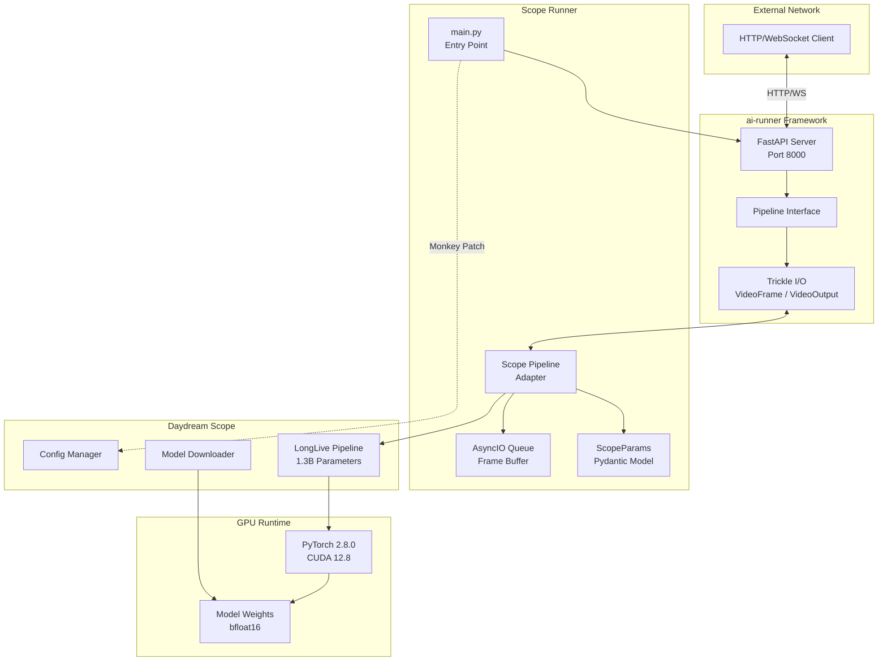
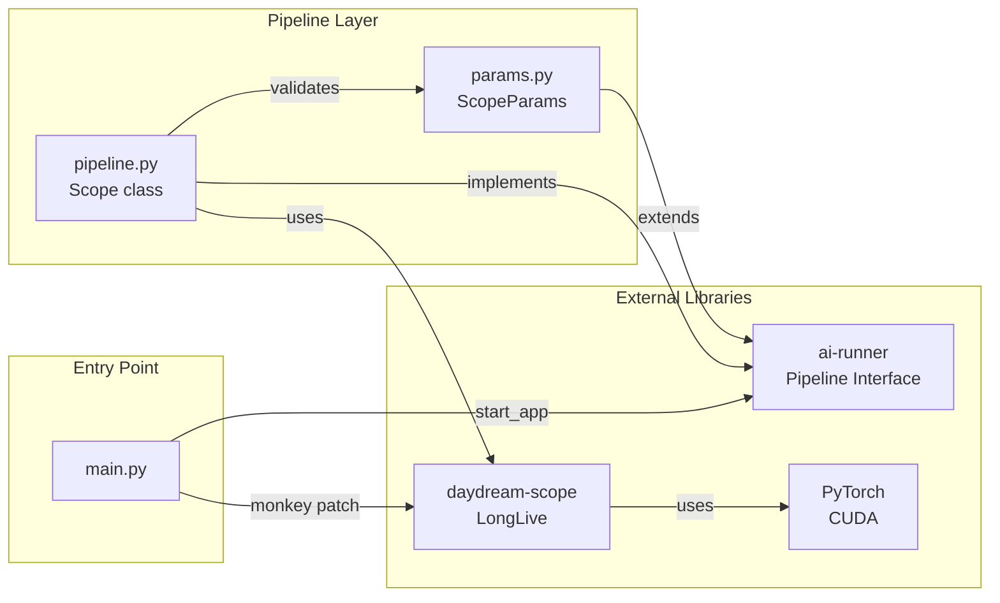
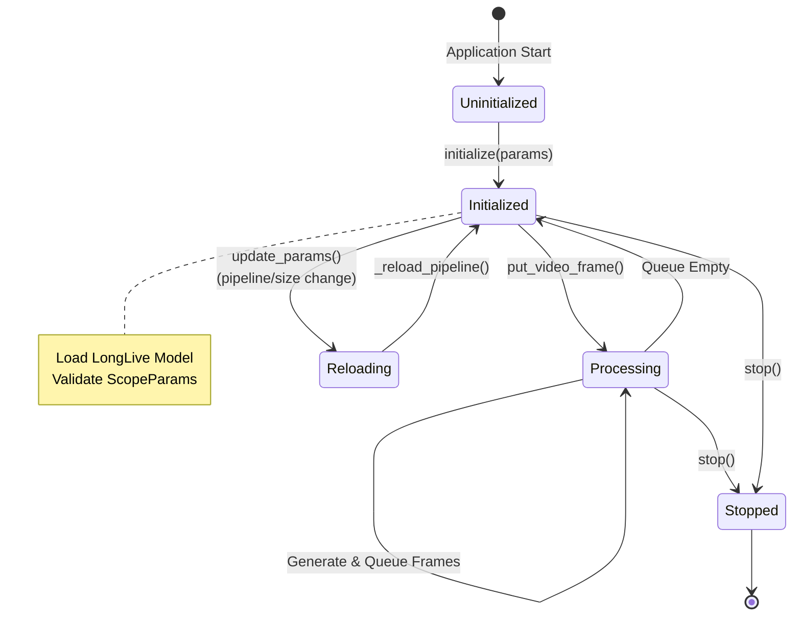
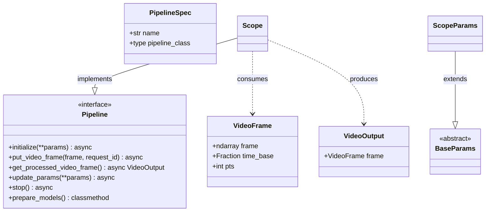
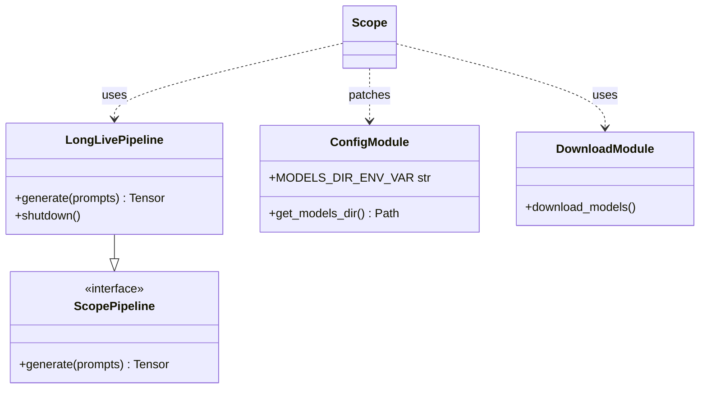
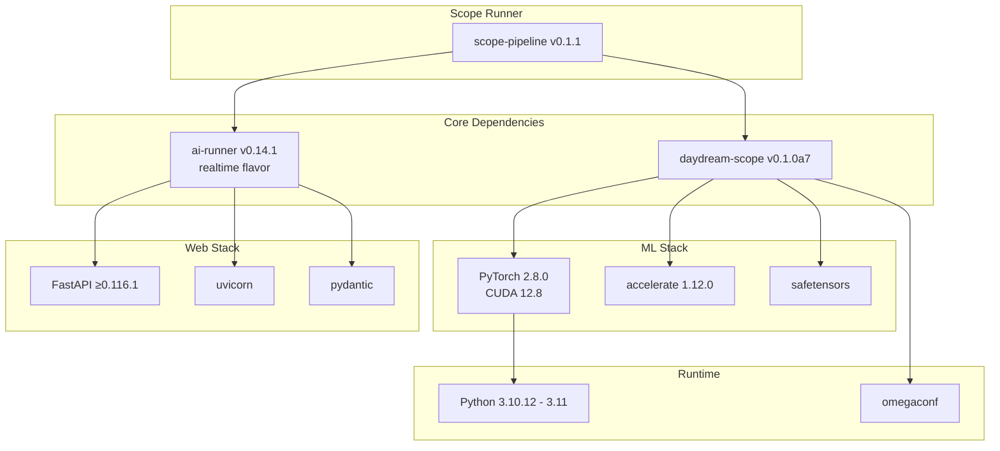
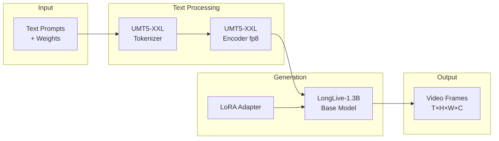
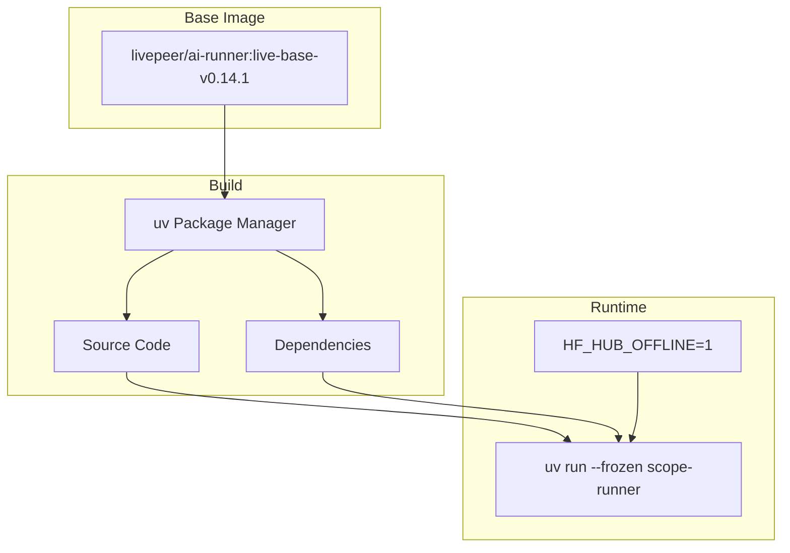

# Scope Runner Documentation

## Overview

**Scope Runner** is an integration layer that connects the **Scope** video generation pipeline with the **ai-runner** framework to run Scope pipelines over the Livepeer network. It enables text-to-video generation capabilities on the decentralized Livepeer network by adapting Scope's LongLive models to work with Livepeer's AI infrastructure.

| Property | Value |
|----------|-------|
| Status | Alpha |
| License | CC BY-NC-SA 4.0 |
| Organization | Daydream Live |
| Primary Use Case | Video generation on decentralized networks |

---

## Architecture



---

## Data Flow

```mermaid
sequenceDiagram
    participant C as Client
    participant AR as ai-runner
    participant SP as Scope Pipeline
    participant Q as Frame Queue
    participant LL as LongLive Model
    participant GPU as CUDA GPU

    C->>AR: Input VideoFrame (trigger)
    AR->>SP: put_video_frame()
    SP->>SP: Submit to ThreadPool

    rect rgb(40, 40, 80)
        Note over SP,GPU: Synchronous Generation (Worker Thread)
        SP->>LL: _generate_sync()
        LL->>GPU: Forward Pass (bfloat16)
        GPU-->>LL: Output Tensor (T,H,W,C)
        LL-->>SP: Generated Frames
    end

    loop For each frame in batch
        SP->>Q: Queue VideoFrame
        Note right of Q: Incremented timestamps
    end

    AR->>SP: get_processed_video_frame()
    SP->>Q: Await frame
    Q-->>SP: VideoFrame
    SP-->>AR: VideoOutput
    AR-->>C: Output VideoFrame
```



---

## Component Interaction



---

## Pipeline Lifecycle



---

## Key Components

### 1. Main Entry Point (`src/scope_runner/main.py`)

- Initializes model directory configuration
- Monkey-patches Scope's config to support ai-runner's `MODEL_DIR` environment variable
- Creates `PipelineSpec` for pipeline registration
- Starts the FastAPI application via `runner.app.start_app()`

### 2. Pipeline Adapter (`src/scope_runner/pipeline/pipeline.py`)

The `Scope` class implements the ai-runner `Pipeline` interface:

| Method | Purpose |
|--------|---------|
| `initialize(**params)` | Load LongLive model, validate parameters |
| `put_video_frame(frame, request_id)` | Trigger video generation (async) |
| `get_processed_video_frame()` | Retrieve generated frames from queue |
| `update_params(**params)` | Update generation parameters at runtime |
| `stop()` | Clean up resources |
| `prepare_models()` | Download models for offline use |

### 3. Parameters (`src/scope_runner/pipeline/params.py`)

```python
class ScopeParams(BaseParams):
    pipeline: Literal["longlive"] = "longlive"
    prompts: List[Union[str, WeightedPrompt]]
    seed: int = 42

class WeightedPrompt(BaseModel):
    text: str
    weight: int = 100
```

---

## External Interfaces

### ai-runner Framework (Livepeer)



| Interface | Import Path | Purpose |
|-----------|-------------|---------|
| `Pipeline` | `runner.live.pipelines` | Base async pipeline interface |
| `BaseParams` | `runner.live.pipelines` | Parameter validation base |
| `PipelineSpec` | `runner.live.pipelines` | Pipeline registration |
| `VideoFrame` | `runner.live.trickle` | Input/output frame structure |
| `VideoOutput` | `runner.live.trickle` | Output wrapper |
| `start_app()` | `runner.app` | FastAPI application launcher |

### Daydream Scope Library



| Interface | Import Path | Purpose |
|-----------|-------------|---------|
| `Pipeline` | `scope.core.pipelines.interface` | Scope pipeline interface |
| `LongLivePipeline` | `scope.core.pipelines` | Video generation model |
| `get_models_dir()` | `scope.core.config` | Model directory path |
| `MODELS_DIR_ENV_VAR` | `scope.core.config` | Environment variable name |
| `download_models()` | `scope.server.download_models` | Model downloader |

### PyTorch Interface

| Interface | Purpose |
|-----------|---------|
| `torch.Tensor` | Frame data in (T, H, W, C) format |
| `torch.cuda.is_available()` | GPU availability check |
| `torch.bfloat16` | Model precision |
| `asyncio.get_running_loop().run_in_executor()` | Offload generation to thread |

### Configuration Interface

| Environment Variable | Purpose | Default |
|---------------------|---------|---------|
| `DAYDREAM_SCOPE_MODELS_DIR` | Scope models directory | `~/.daydream-scope/models/` |
| `MODEL_DIR` | ai-runner orchestrator model dir | - |
| `HF_HUB_OFFLINE` | Disable HuggingFace online access | `1` (in Docker) |

---

## Dependencies



| Dependency | Version | Source | Purpose |
|------------|---------|--------|---------|
| `ai-runner[realtime]` | 0.14.1 | Livepeer GitHub | Framework, HTTP server |
| `daydream-scope` | 0.1.0a7 | Daydream GitHub | Video generation models |
| `torch` | 2.8.0+cu128 | PyPI | GPU computation |
| `accelerate` | 1.12.0 | PyPI | Multi-device support |
| `fastapi` | ≥0.116.1 | PyPI | Web framework |
| `pydantic` | ≥2.0 | PyPI | Data validation |
| `omegaconf` | Latest | PyPI | Configuration |

---

## Model Architecture



| Component | File | Purpose |
|-----------|------|---------|
| Generator | `LongLive-1.3B/models/longlive_base.pt` | Base video model |
| LoRA | `LongLive-1.3B/models/lora.pt` | Adapter weights |
| Text Encoder | `WanVideo_comfy/umt5-xxl-enc-fp8_e4m3fn.safetensors` | Text embedding |
| Tokenizer | `Wan2.1-T2V-1.3B/google/umt5-xxl` | Text tokenization |

---

## Deployment

### Docker



### Image Tags

| Tag | Trigger | Purpose |
|-----|---------|---------|
| `daydreamlive/scope-runner:main` | Push to main | Staging |
| `daydreamlive/scope-runner:latest` | Git tag | Production |
| `daydreamlive/scope-runner:v0.1.1` | Git tag v0.1.1 | Version pin |

---

## Usage

### Running the Server

```bash
# Start the server
uv run scope-runner

# Prepare models for offline use
uv run scope-runner --prepare-models
```

### API

The server exposes a FastAPI application on port 8000 with endpoints inherited from ai-runner for real-time video streaming via HTTP and WebSocket.

---

## Design Patterns

| Pattern | Implementation |
|---------|----------------|
| **Adapter** | `Scope` class adapts ai-runner interface to Scope |
| **Producer-Consumer** | AsyncIO queue decouples generation from output |
| **Thread Pool** | GPU generation offloaded to worker thread |
| **Lazy Loading** | Models loaded on `initialize()`, not import |
| **Configuration Injection** | Environment variables for deployment flexibility |
